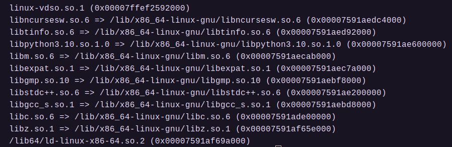

###### OS大赛 - 内核设计loongarch赛道 - 俺争取不掉队

-------------------------------------------------------------

# xv6-qemu-Loongarch-ls2k 

俺争取不掉队设计的基于qemu-ls2k的os是基于xv6-ls3A5000修改而来的。

### 搭建开发环境

`声明：本文档只适合在x86-64架构主机上搭建开发环境`

1. 克隆项目到本地。
2. 打开顶层Makefile，更改`TOOLPREFIX`，这个是编译工具链的前缀，例如`loongarch64-linux-gnu-gcc`的前缀是`loongarch64-linux-gnu-`，请确保加上前缀后的gcc在本地是有效的命令。由于龙芯的工具链版本较多，且偶尔有兼容性问题，这里推荐使用大赛给出的工具链版本：[大赛工具链](https://github.com/LoongsonLab/oscomp-toolchains-for-oskernel)，同时这个仓库里面有相应的gdb。
3. 打开ls2k_debug.sh，更改qemu路径，qemu使用龙芯实验室提供的[大赛qemu](https://github.com/LoongsonLab/2k1000-materials)。
4. 使用`make initdir`初始化构建路径，每次新增模块都应执行这个命令。
5. 使用`make all`构建项目。
6. 执行`ls2k_debug.sh`运行，默认开启-s选项等待gdb接入调试。
7. 使用`vscode`+`gdb`调试，请修改`lanuch.json`中的`miDebuggerPath`为你自己的gdb命令。

#### `搭建开发环境可能遇到的问题`

1. 官方给出的交叉工具gdb是动态库版本，会有不明依赖，推荐使用`Ubuntu 22.04`。
2. 目前已知的依赖的包括：
	i. python请使用python3.10，或者将`libpython3.10.so.1.0`放入`/lib/x86_64-linux-gnu/`，重启主机。
	ii. `libstdc++.so.6`以及`libc.so.6`可能不同版本不一样，尝试更新为最新版本。
3. 其他依赖详见下图：

### 文档 

#### 1. [=> Makefile工程](./doc/project.md)

#### 2. [=> 关于HAL与CSR](./doc/hal.md)

#### 3. [=> ls2k的IO方式](./doc/ls2k_io.md)