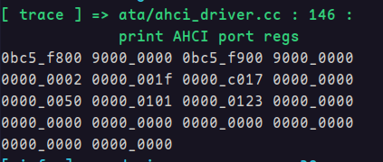
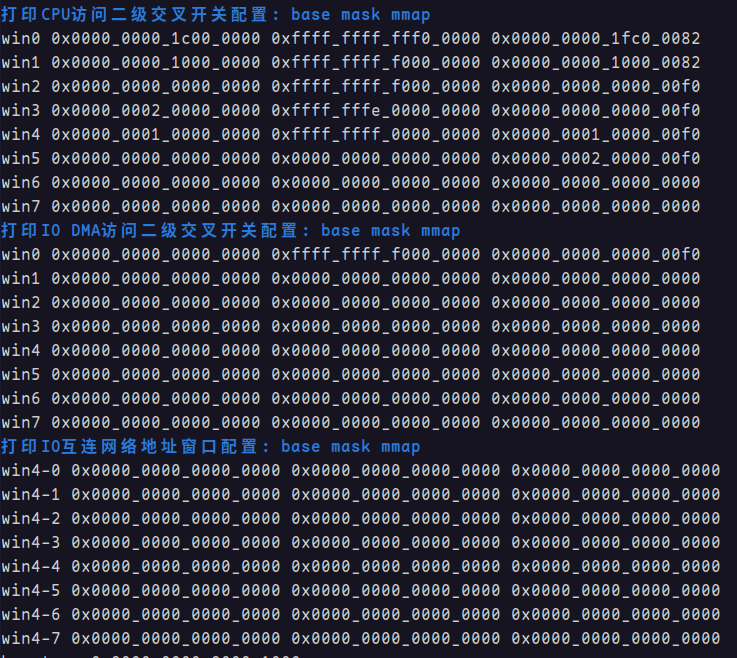

<font face="Maple Mono SC NF">

###### OS大赛 - 内核设计loongarch赛道 - 俺争取不掉队

-------------------------------------------------------------

# 适配2k1000星云板

## 1. 配置tftp服务器

安装 tftp 服务程序

	sudo apt install tftpd-hpa

打开 tftp 服务

	sudo service tftpd-hpa start

查看 tftp 服务状态

	sudo service tftpd-hpa status

如果 tftp 服务正常打开，可以看到类似如下的信息：

```
● tftpd-hpa.service - LSB: HPA's tftp server
     Loaded: loaded (/etc/init.d/tftpd-hpa; generated)
     Active: active (running) since Mon 2024-08-12 15:16:41 CST; 9h ago
       Docs: man:systemd-sysv-generator(8)
    Process: 2618 ExecStart=/etc/init.d/tftpd-hpa start (code=exited, status=0/SUCCESS)
      Tasks: 1 (limit: 18750)
     Memory: 544.0K (peak: 1.6M swap: 40.0K swap peak: 40.0K)
        CPU: 282ms
     CGroup: /system.slice/tftpd-hpa.service
             └─2644 /usr/sbin/in.tftpd --listen --user tftp --address :69 --secure /srv/tftp
```

其中CGroup中的参数 `--secure` 的值 `/srv/tftp` 就是本机tftp访问的路径，所有客户端经过tftp访问本机都会在这个路径下查找文件。

然后查看本机网络ip

	ifconfig

当然可以自己配置一个ip地址。对于ubuntu而言，在设置>网络>有线>网络选项>IPv4中，选择使用手动方式，然后在下面的地址中配置ip和掩码，建议使用192.168.\*.\*的ip，因为这是一个内网路由，而掩码配置为255.255.255.0。例如，我将地址配置为`192.168.2.2`，子网掩码配置为`255.255.255.0`。

## 2. 使用串口监听器接收开发板调试输出

这里以minicom为例。

安装minicom

	sudo apt install minicom

安装好后，使用下面的命令配置 minicom

	minicom -s

此时进入到 minicom 配置对话框，进入到串口设置，并配置串行设备为 `/dev/ttyUSB0`，如果这个设备不存在，你可能需要检查一下接入的设备名称。回到配置对话框，并选择保存设置为dfl后，可退出配置对话框。

此处还需解决两个问题：(1) 接收的数据回显到终端时，换行不会执行回车，使得打印的字符一直向右偏移。(2) 此时的minicom是黑白的，无法打印彩色字符。

问题(1) 可以通过进入minicom后，按键 `Ctrl+A` 然后 `Z` 调出minicom菜单，使用 `U` 来开启自动回车。也有一劳永逸的方法：在 `~/.minirc.dfl` 中加入下面的命令：

	pu addcarreturn    Yes

如果你使用root用户，那么这个文件路径应当是`/etc/minicom/minirc.dfl`。如果有仍然疑问可以参考 [StackExchange上的一篇提问](https://unix.stackexchange.com/questions/283924/how-can-minicom-permanently-translate-incoming-newline-n-to-crlf)。

问题(2) 的解决方法则通过在打开 minicom 的时候，添加参数 `-con`。

	minicom -con

此时进入的界面便支持彩色。也可以为 minicom 添加环境变量，使得 `minicom` 命令也能像 `minicom -con` 一样进入彩色终端。环境变量应当如下方式定义：

	MINICOM='-con'
	export MINICOM

将这两条语句添加进 `~/.bashrc`，然后使用 `source ~/.bashrc` 更新环境变量即可。如果仍然有疑问可以参考这篇 [WiKi](https://wiki.emacinc.com/wiki/Getting_Started_With_Minicom)。

## 3. uboot+tftp 启动内核

先把编译好的内核拷贝到前面配置tftp服务器时显示的访问路径，注意内核文件不是elf而是不带elf格式信息的纯bin文件。当然，uboot可以使用 uImage 文件，但是此处我们使用裸启动。

然后启动星云板，在进入linux之前，按住c进入uboot终端。

可以使用 `printenv` 查看此时的uboot环境变量。

```
baudrate=115200
bootargs=console=ttyS0,115200 rootfstype=ext4 rw rootwait

...

ipaddr=192.168.2.3
loadaddr=0x9000000090000000

...

netmask=255.255.255.0

...

serverip=192.168.2.2

...
```

例子中只展示了部分重要的变量，例如当前串口波特率，本机ip地址，本机子网掩码，tftp服务器ip地址，内核加载地址等。

可以使用 `setenv env-name env-value` 来配置环境变量的值。

为了适配我们当前的内核和tftp服务器，应当使用下面的命令进行配置：

	setenv ipaddr 192.168.2.3
	setenv serverip 192.168.2.2
	setenv netmask 255.255.255.0
	setenv loadaddr 0x9000000090000000

配置完了之后，使用 `saveenv` 来将配置持久化，刷写到 SPI flash
中。

此时可以使用 `ping 192.168.2.2` 来查看网络是否通畅。

```sh
=> ping 192.168.2.2
Speed: 1000, full duplex
Using ethernet@40040000 device
host 192.168.2.2 is alive
```

打印的信息提示 host is alive 则网络通畅。

然后使用 `tftpboot ${loadaddr} kernel.bin` 来将内核从服务器下载到内存的 ${loadaddr} 的位置上。

接着使用 `go ${loadaddr}` 即可将执行权交给内核。

在跳转之前，如果对内存中的数据有疑问可以使用 `md` 命令，例如

	md ${loadaddr}

会将内存指定地址的一段数据转储并显示到终端上。

```
=> md ${loadaddr}
9000000090000000: 1a00142c 28cf618c 4c000180 0380440c  ,....a.(...L.D..
9000000090000010: 0324018c 0406002c 0380040c 0320018c  ..$.,......... .
9000000090000020: 0406042c 0015000c 0406082c 04060c2c  ,.......,...,...
9000000090000030: 0402202c 0382c00c 0400002c 06498000  , ......,.....I.
9000000090000040: 18a56c83 14000084 04008005 02c000a2  .l..............
9000000090000050: 02c004a5 001d9484 00109063 44002040  ........c...@ .D
9000000090000060: 1850ba0c 18a96bed 0015000e 6c00118d  ..P..k.........l
9000000090000070: 29c0018e 02c0218c 53fff7ff 564ebc01  ...).!.....S..NV
9000000090000080: 54dd8401 50000000 00000000 00000000  ...T...P........
9000000090000090: 00000000 00000000 00000000 00000000  ................
90000000900000a0: 00000000 00000000 00000000 00000000  ................
90000000900000b0: 00000000 00000000 00000000 00000000  ................
90000000900000c0: 00000000 00000000 00000000 00000000  ................
90000000900000d0: 00000000 00000000 00000000 00000000  ................
90000000900000e0: 00000000 00000000 00000000 00000000  ................
90000000900000f0: 00000000 00000000 00000000 00000000  ................
```

uboot 其他命令简介：

`poweroff` 可以用于将星云板软关机。


# 适配2k1000星云板过程中遇到的问题

## 1 关于地址对齐

## 2 SATA控制器初始化和使用

### 2.1 SATA控制器（AHCI）初始化

实际上 uboot 可以为我们初始化 SATA 控制器到最小可用的AHCI模式，在uboot控制台使用命令

	scsi reset
	或
	scsi scan 

可以一键初始化SATA控制器

### 2.2 SATA的DMA访存异常

#### 2.2.1 问题描述

在试验的过程中，我发现当我给 AHCI 的端口寄存器 CLB 和 FB 分别分配Command List和FIS的地址时，DMA访存似乎出现了异常，如图是我分配地址之后，端口寄存器的值


其中开头的四个数值分别是AHCI文档所述的 CLB、CLBU、FB、FBU 寄存器的值，即我为这个端口分配的 CLB 和 FB 的地址分别是 `0x9000'0000'9020'8000` 和 `0x9000'0000'9020'6000`。

这两个地址在AHCI文档所述中是及其重要的地址，因为SATA的两个DMA根据这两个地址分别来获取要发送的命令和接受到FIS需要存储的位置。当我使用上述的CLB地址的时候，我发现我发送 `READ DMA EXT` 命令（代码25h）是无效的，经过试验我猜测是SATA的DMA无法读出这个地址内的数据（这个地址里面就配置了我要发送的命令）。然后DMA一直试图访存读出有效的命令，但是一直失败，于是端口一直处于忙状态（端口寄存器`TFD.STS.BSY`为1表示忙状态）并且无法发出命令，自然也无法正确地读出数据。

而当我将CLB和FB的地址改成使用uboot的地址之后访存就正常了。换句话说，我通过对比uboot的地址和我的内核提供的地址来访存是否正常，推测出了上述的访存失败。下面是我使用uboot提供的地址的具体操作。

我使用 uboot 初始化SATA控制器时使用的地址。即，我先在 uboot 中使用 `scsi reset` 命令来重置 SATA 控制器，并且经过试验我发现 uboot 已经配置好了 CLB 和 FB，如图所示是端口寄存器的值。



可以看到 CLB 的地址是 `0x9000'0000'0BC5'F800`，而 FB 的地址是 `0x9000'0000'0BC5'F900`。这个地址和我配置的地址看上去最大的不同是低32位的高4位不是`0x9`而是`0`，这个地址是属于uboot所在的`0x0000'0000~0x1000'0000` 空间（即便高4位是0x9有点奇怪，但是它确实能正常访存）。而当我使用这个地址的时候，发送命令就正常了，不仅成功发送了命令，而且命令执行完成后也正常发生了中断，一切都是正常的。

我推测这是来自 2k1000LA 对 IO互连网络的地址路由的配置问题。于是我将`二级交叉开关地址窗口` 和 `IO互连网络地址窗口` 打印了出来。



理论上来说，SATA控制器的DMA应当经过IO互连网络地址窗口到达二级交叉开关，然后再经过二级交叉开关的地址窗口映射到内存当中，但是按照上面输出的信息，IO互连网络并没有被配置。那么**SATA控制器的DMA是如何访存的呢**？

假定SATA DMA不经过IO互连网络，那么到达二级交叉开关的时候会经过上图中IO DMA的win0窗口映射，看起来它的确屏蔽了我的以`0x9020'8000`为地址的CLB（但是这里依旧有疑问：使用uboot提供的**高32位中的高4位明明是0x9，但是为什么没有被窗口过滤呢？**）。

假设是窗口映射有问题，我将IO DMA的win0的mask配置为 `0xFFFF'FFFF'0000'0000`，使得 `0x9***'****` 这样的地址可以通过win0的窗口，但是我发现没有用。

这个时候我已经搞不明白二级交叉开关和IO互连网络的路由遵循什么机制了，因为上述的实验说明星云板上的2k1000LA似乎没有遵循手册上的逻辑？

这里面有两个问题亟待解决：

1) **我应当如何配置窗口地址映射，使得我提供的`0x9***'****`这样的地址也能被正常访问？**
2) **为什么64位地址的高4位是`0x9`也没有影响访存，二级交叉开关和IO互连网络的窗口映射逻辑应当如何正确理解？**

#### 2.2.2 进一步探索

为了知道 SATA DMA 是如何访存的，我从最简单的试验做起。

我首先将二级交叉开关的IO-DMA访存窗口全部重置为0，但结果让我大吃一惊，因为 SATA-DMA 的访存依旧正常，只要使用的是 uboot 空间的地址就没有任何问题。

难道 **SATA DMA没有经过二级交叉开关的 IO-DMA 访存吗？** *————疑惑(1)*

假设 *疑惑(1)* 的假设是对的，那么影响访存的就只能是二级交叉开关的CPU访存了。其中的win2疑似最大，这个窗口恰能把我的内核地址过滤又让uboot地址通过。

于是我将win2的mask修改为 `0xFFFF'FFFF'0000'0000`，这样就能让我的内核地址通过。
