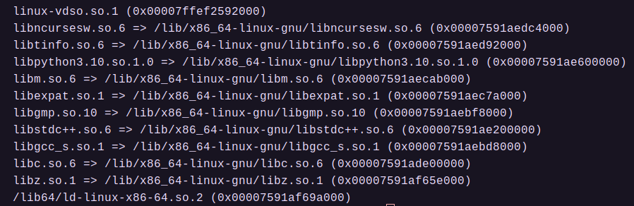

<font face="Maple Mono SC NF">

###### OS大赛 - 内核设计loongarch赛道 - 俺争取不掉队

-------------------------------------------------------------

[`<= 回到目录`](../README.md)

# 开发环境搭建指引

`声明：本文档只适合在x86-64架构主机上基于Linux(Ubuntu)搭建开发环境`

## 1. 搭建基础开发环境 (Ubuntu+VSCode+GCC+QEMU+GDB)

### 1.1 项目配置

1) 克隆项目到本地。

2) 打开顶层Makefile，更改`TOOLPREFIX`，这个是编译工具链的前缀，例如`loongarch64-linux-gnu-gcc`的前缀是`loongarch64-linux-gnu-`，请确保加上前缀后的gcc在本地是有效的命令。由于龙芯的工具链版本较多，且偶尔有兼容性问题，这里推荐使用大赛给出的工具链版本：[大赛工具链](https://github.com/LoongsonLab/oscomp-toolchains-for-oskernel)，同时这个仓库里面有相应的gdb。

3) 配置架构。在Makefile中配置CONF_ARCH和CONF_PLATFORM，即架构名称和芯片名称。构建项目时会依照两个名称到hal目录下寻找子模块。

4) 使用`make all`构建项目。项目会生成一个路径 build/，生成的内核名称为kernel.elf，同时项目也会生成一个纯二进制内核kernel.bin。

5) 配置一个sh脚本`ls2k_debug.sh`用于运行qemu，qemu使用龙芯实验室提供的[大赛qemu](https://github.com/LoongsonLab/2k1000-materials)。运行qemu的脚本可参考：

```sh
#!/bin/bash 

# 通常情况下该文件应当放在项目的根目录下

RUNENV_PREFIX=your_qemu_path
KERNEL_PREFIX=`pwd`

cd $RUNENV_PREFIX

./bin/qemu-system-loongarch64 \
	-M ls2k \
	-serial stdio \
	-k ./share/qemu/keymaps/en-us \
	-kernel ${KERNEL_PREFIX}/build/kernel.elf \
	-serial vc \
	-m 1G \
	-net nic \
	-net user,net=10.0.2.0/24,tftp=/srv/tftp \
	-vnc :0 \
	-S -s \
	-hda your_2kfs_img \
	-hdb your_sdcard_img 
```

### 1.2 vscode 环境配置

1) 使用`vscode`+`gdb`调试，需要在.vscode中配置`lanuch.json`。参考配置如下：

```json
{
	"version": "0.2.0",
	"configurations": [
		{
			"name": "qemu-ls2k-start (debug)",
			"type": "cppdbg",
			"request": "launch",
			"cwd": "${workspaceFolder}",
			"program": "./build/kernel.elf",
			"args": [],
			"stopAtEntry": false,
			"environment": [],
			"externalConsole": true,
			"MIMode": "gdb",
			"miDebuggerPath": "loongarch64-linux-gnu-gdb",
			"miDebuggerServerAddress": "localhost:1234",
			"preLaunchTask": "qemu ls2k"
		}
	]
}
```

上述配置实际上还配置了一个终端任务`qemu ls2k`，这个任务用于运行前面配置好的运行qemu的脚本，以在vscode启动gdb之前确保打开qemu，然后再用gdb接入调试。`qemu lask` task的配置参考如下：

```json
{
	"version": "0.2.0",
	"tasks": [
		{
			"label": "qemu ls2k",
			"type": "shell",
			"command": "echo 'TaskInfo: QEMU Starting' && echo 'TaskInfo: Start Debug' && ./ls2k_debug.sh",
			// 使用下面这个command还可以不使用vscode集成中断，另外打开一个ubuntu终端来运行qemu
			// "command": "echo 'TaskInfo: QEMU Starting' && echo 'TaskInfo: Start Debug' && gnome-terminal -- ./ls2k_debug.sh",
			"presentation": {
				"echo": true,
				"clear": true,
				"group": "qemu"
			},
			"isBackground": true,
			"problemMatcher": [
				{
					"pattern": {
						"regexp": ".*(错误)",
						"severity": 0
					},
					"background": {
						"activeOnStart": true,
						"beginsPattern": "^TaskInfo: QEMU Starting",
						"endsPattern": "^TaskInfo: Start Debug"
					}
				},
				"$gcc"
			]
		}
	]
}
```

2) 如果上述配置一切顺利，在vscode的`运行和调试`中应该已经配置好了启动任务`qemu-ls2k-start (debug)`，在确保项目构建无误后可以直接启动（上述vscode配置并不会自动编译项目）。


### 1.3 搭建开发环境可能遇到的问题

1) 官方给出的交叉工具gdb是动态库版本，会有不明依赖，推荐使用`Ubuntu 22.04`。也可以使用大赛的docker镜像，可以确保依赖都已经安装完毕，但是使用docker可能给开发带来不便。

2) 目前已知的依赖的包括：

	1) python请使用python3.10，或者将`libpython3.10.so.1.0`放入`/lib/x86_64-linux-gnu/`，重启主机。如果有更高版本的动态库，可以尝试创建libpython3.10.so.1.0的符号链接直接指向高版本动态库，实测libpython3.12可以正常使用。

	2) `libstdc++.so.6`以及`libc.so.6`可能不同版本不一样，尝试更新为最新版本。

3) 其他依赖详见下图：


## 2. 调试重定位程序（用户程序）

用户程序通常是通过系统调用execve将程序映像加载到内存中运行，具体加载的位置是由用户程序的elf格式定义的，这意味着用户程序是一个重定位程序，必须要在运行时，将用户程序的符号表额外地加载到gdb，gdb才能根据符号映射到响应的地址设置断点。具体方法如下：

1) 编译用户程序，一定要保留调试信息，否则生成的elf文件不会包含符号表，从而gdb无法解析符号。如果不确定生成的文件是否包含调试信息，可以使用 `readelf -l *.elf` 查看是否有debug相关的程序段。

2) 启动qemu运行内核，然后暂停运行，切换到调试控制台（或gdb命令行）。

3) 使用 `add-symbol-file elf文件路径` 的方式添加符号表，注意在vscode控制台中，输入gdb命令需要使用 `-exec 命令` 的方式。gdb解析符号表成功后，就可以在源码上添加断点。

4) 另外，如果使用他人编译好的elf文件，可能其中的符号表映射的源代码位置与本地的源代码位置不符，可以先使用 `info sources` 命令列出符号表映射的源代码位置。如果发现不符，那么这个符号是无法被定位到本地的源代码位置的，可以使用 `set substitude-path elf中符号映射的源码路径前缀 需要替换的源码路径前缀`，例如，如果发现elf文件中的符号映射源码路径的前缀是 /home/Jack/ ，但是本地的源码路径应当在 /home/Brown/ 当中，可以使用命令 set subtitude-path /home/Jack/ /home/Brown/ 进行路径替换。
