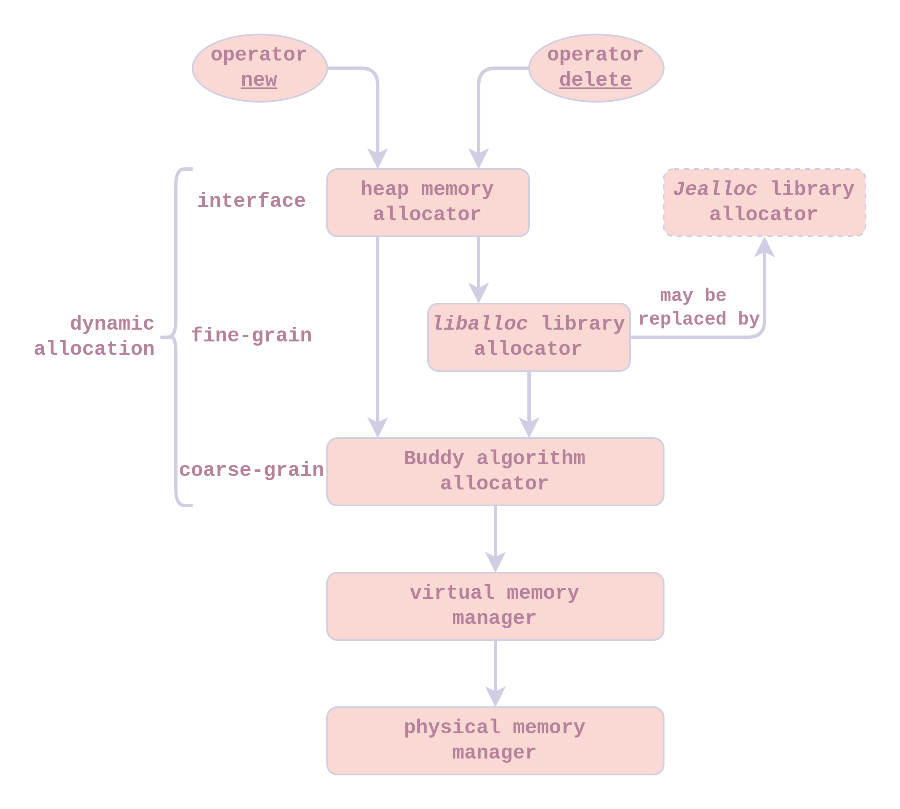

###### OS大赛 - 内核设计loongarch赛道 - 俺争取不掉队

-------------------------------------------------------------

[`<= 回到目录`](../README.md)

# 动态内存

动态内存分配器的结构总览如下图所示。

{:height="70%" width="70%"}

## 1 Buddy Algorithm 

伙伴算法用于粗粒度的动态内存分配，其最小分配单位为虚拟页。

实际上，这里的伙伴算法并没有像Linux用于物理内存分配，而是用于虚拟内存分配。

物理内存分配是采用简单地将物理页用链表的方式连接起来管理的，这种方式不保证连续两次分配的物理页是地址连续的，但这种物理页分配方式效率很高，我们对此进行了保留。为了解决大块内存动态分配的问题，这里采用在虚拟空间上使用伙伴算法的方案。

### 1.1 user heap memory 

地址空间划分可见 [**`用户地址空间划分`**](./memlayout.md#1-用户地址空间)

*用户堆内存暂时没有实现*

### 1.2 kernel heap memory

地址空间划分可见 [**`内核地址空间划分`**](./memlayout.md#2-内核地址空间)

内核堆内存范围暂时设定为 0x0000_0000 ~ 0x003F_FFFF（4MiB大小）。