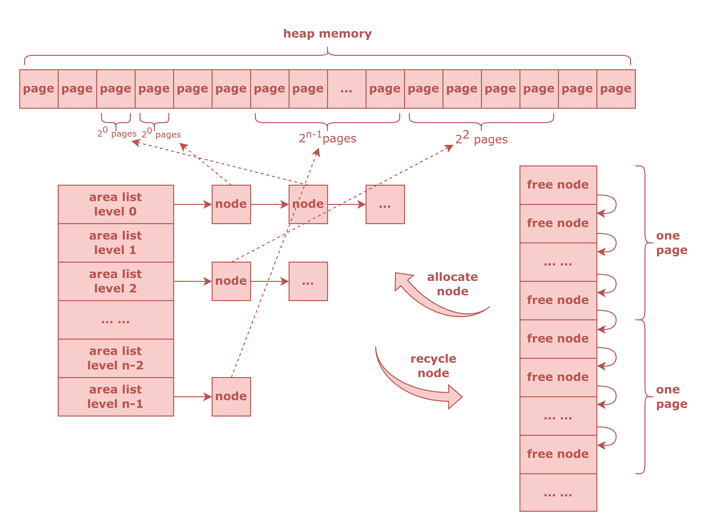

###### OS大赛 - 内核设计loongarch赛道 - 俺争取不掉队

-------------------------------------------------------------

[`<= 回到目录`](../README.md)

# 动态内存

动态内存分配器的结构总览如下图所示。

{:height=70% width=70%}

## 1 Buddy Algorithm 

伙伴算法用于粗粒度的动态内存分配，其**最小分配单位为虚拟页**。

实际上，这里的伙伴算法并没有像Linux用于物理内存分配，而是**用于虚拟内存分配**。

物理内存分配是采用简单地将物理页用链表的方式连接起来管理的，这种方式不保证连续两次分配的物理页是地址连续的，但这种物理页分配方式效率很高，我们对此进行了保留。为了解决大块内存动态分配的问题，这里采用在虚拟空间上使用伙伴算法的方案。

在当前的设计中，**堆大小暂时不可调整**，在后续开发中会解决这个问题。

### 1.1 user heap memory 

地址空间划分可见 [**`用户地址空间划分`**](./memlayout.md#1-用户地址空间)

*用户堆内存暂时没有实现*

### 1.2 kernel heap memory

地址空间划分可见 [**`内核地址空间划分`**](./memlayout.md#2-内核地址空间)

内核堆内存范围暂时设定为 `0x0000_0000` ~ `0x003F_FFFF`（4MiB大小），这个范围可能在后面的开发中会有所调整。

### 1.3 data structure 

伙伴算法的数据结构图如下。

{:height=70% width=70%}

图中的 node 是用于描述一个空间区域的数据结构，此处称其为 **Buddy Node (bnode)**。
bnode 是动态分配的，一个 bnode 可以描述一个 $2^k$ 个虚拟页的空间区域，指数 k 是区域链表 (area list) 的等级，也是图中链表数组的索引。area list 是由最大长度的，这由 heap 的最大大小所决定，但是 bnode 的动态分配使得 heap 的大小可以动态调整。

> 实际上，此处的 area list 数组也可以改进为动态长度的，以使得 heap 的动态大小调整更为自由，然后将 heap 的大小调整就应当包含动态检查，以防止越入高地址处的栈区。

