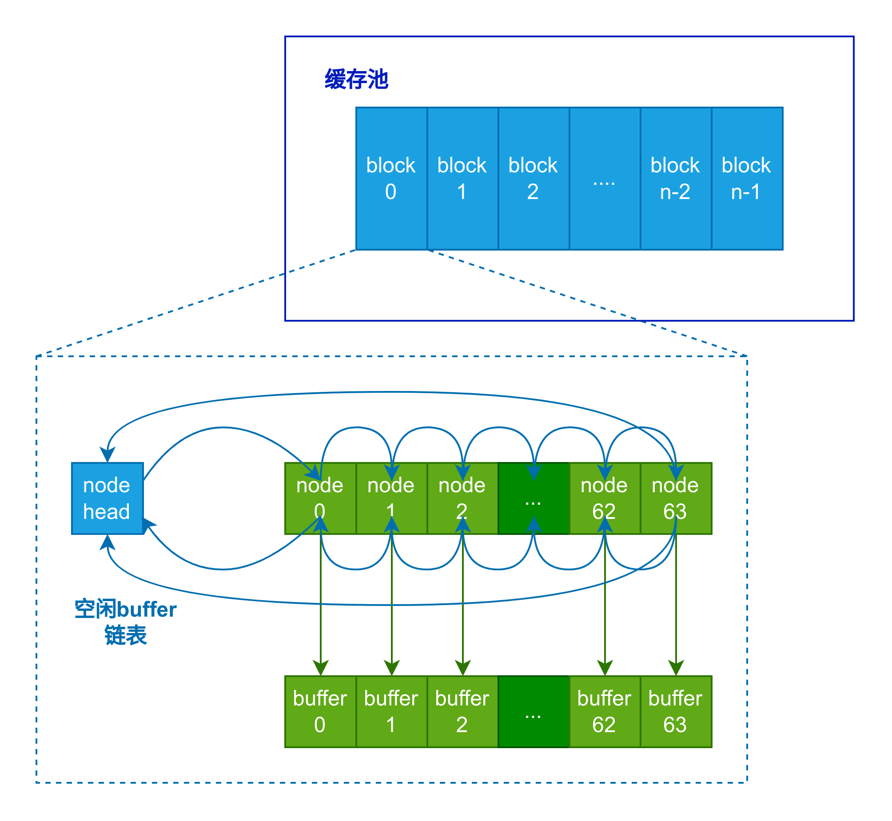

###### OS大赛 - 内核设计loongarch赛道 - 俺争取不掉队 

-------------------------------------------------------------

[`<= 回到文件系统`](../fs.md)

# 缓存池设计

## 1. 缓存池结构概述

缓存池采用多级设计，可参考下图。

## 2. block 

缓存池有若干block，每个block都会有64个buffer，每个buffer大小为512Bytes，因而一个block为32KiB。