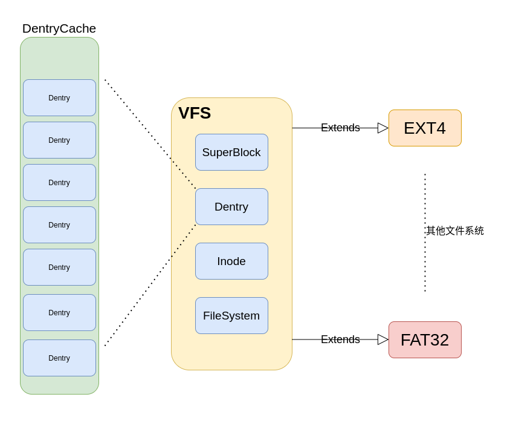
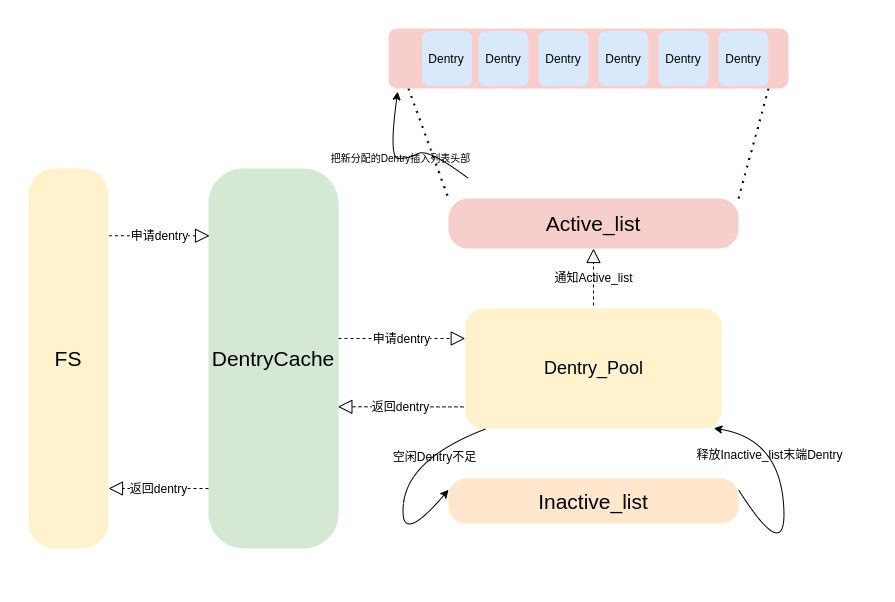
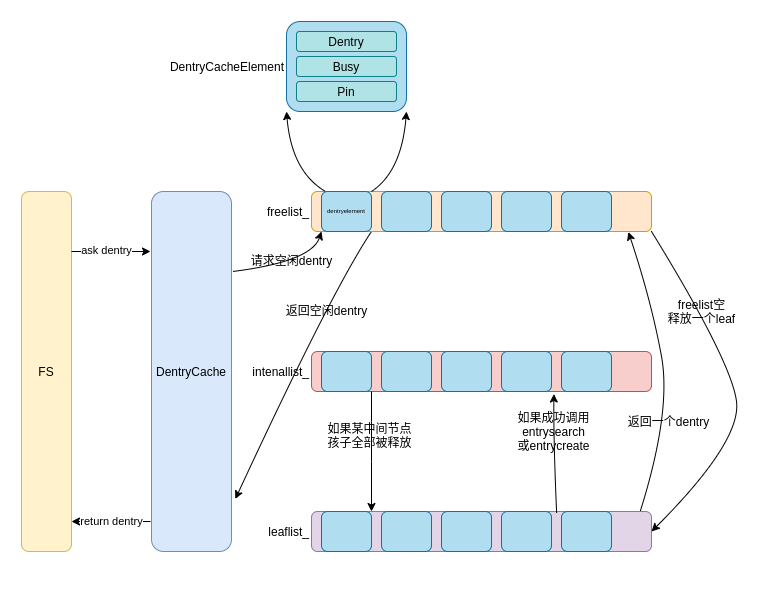

###### OS大赛 - 内核设计loongarch赛道 - 俺争取不掉队

---------------------------------------------

[ `<= 回到文件系统`](../fs.md)

# VFS简介 

虚拟文件系统（VFS）提供了一个统一的接口来访问不同的文件系统，使得上层用户空间程序无需关心底层使用的是哪种文件系统。VFS通过几个关键的结构体实现这一抽象层，包括SuperBlock、Dentry、Inode和FileSystem。

- **SuperBlock**：超级块是VFS的核心组件之一，它包含了文件系统的元数据信息，如文件系统类型、大小和状态，以及一些文件系统操作的方法。

- **Dentry**：Dentry（目录项）主要用于维护文件名与Inode之间的映射关系，它是内存中文件系统树的一个节点，使得文件系统的遍历成为可能。

- **Inode**：Inode结构体保存了文件的元数据，如文件权限、大小和创建时间等，同时也包含了操作该文件的函数。

- **FileSystem**：这代表了实际的文件系统实现，如EXT4、FAT32等。每种文件系统都有其特定的实现方式，但它们都通过VFS提供的统一接口与上层应用交互。

通过这些组件的协同工作，VFS能够提供一个高效且统一的文件操作接口，简化了文件系统的管理和使用。

## VFS结构概述 
请参考下图

## DentryCache 目录项缓冲池  Version 1

为了方便对文件系统中的目录项进行统一的管理，因此我们使用缓冲池，缓冲池中的分配策略采用LRU(最近最少使用)。DentryCache服务于FS，其主要维护了两个DentryList和一个DentryPool，下面介绍其工作原理。 
- **allocDentry**：从目录项池中分配一个空闲的目录项，并把该目录项移入活跃链表(Active_list)；如果池中没有多余的空闲目录项，则从非活跃链表尾部释放一个目录项供分配，并同步递归释放其所有子目录项。
- **touchDentry**: 每当我们访问一个dentry，就需要调整其在LRU链表中的位置，如果其在活跃链表中，则将其移动到活跃链表的首部，否则将其从非活跃链表中移动到活跃链表首部，并递归地移动其所有祖先节点。

#### DentryCache 分配目录项过程
请参考下图 

## DentryCache 目录项缓冲池 Version 2

由于第一版的dentryCache中有部分冗余数据结构，另外对于dentry的释放时机也不太准确，因此重新调整dentrycache的结构。 
- **数据结构**：
    1. *** freelist_***：空闲dentry链表
    2. *** leaflist_***: 内存中打开的文件系统树的中间结点链表
    3. *** intenallist_***: 内存中的文件系统树的叶结点链表 
    4. *** dentryCacheElement ***： 链表的元数据，由dentry，pin，busy三个属性构成。 dentry指向一个dentry，pin位表示该dentry是否可以被释放，默认的，中间结点和挂载点都不能直接被释放，busy位表示该dentry是否处于空闲状态。 
- **组织方式**：dentryCache在初始化阶段初始化若干dentry，全部放入空闲链表freelist_中，当文件系统申请一个dentry时，dentry缓冲池优先从freelist分配出一个空闲dentry， 
如果freelist_为空，则转而去文件树的叶子结点链表leaflist_中释放头部的一个dentry，如果被释放的dentry的双亲dentry的孩子在释放dentry后为空，则将其移动到leaflist_中，相应的， 
当我们在一个dentry中成功执行了entrysearch或者entrycreate，我们也会将这个dentry从leaflist_移动到intenallist_，以此来对文件系统进行一些优化加速。
#### DentryCacheV2 分配目录项过程 
请参考下图

