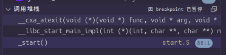

<font face="Maple Mono SC NF">

###### OS大赛 - 内核设计loongarch赛道 - 俺争取不掉队

-------------------------------------------------------------

[`<= 回到目录`](../README.md)

# 如何适配使用glibc的用户程序

## 1. 在异常和调试中摸索

### 1.1 exit异常

记录一次在qemu-2k1000上运行的诡异的bug。
这个bug产生自glibc的exit库函数。实际上是适配的问题。
此处使用的glibc版本为2.38。

#### 1.1.1 问题描述

用户程序调用exit库函数后，没能成功进行exit系统调用（真正的系统调用签名为 _exit(int status) ）。
实际上，glibc需要在_exit之前完成一些线程以及IO有关的工作。
这主要包括TLS析构和和IO缓存刷新。

而用户调用exit后，即在TLS析构和IO缓存刷新的过程中发生了PIF（取指操作页无效异常）。


可以看到badv是0x2，这是一个不允许的取指地址（当然era也是0x2，这里疑似是qemu的bug，它使我无法定位异常发生的位置）。

#### 1.1.2 调试追踪

直到当我学会调试用户程序后，我才在glibc中定位到了 stdlib/exit.c:__run_exit_handlers 这个函数中一个奇怪的变量。
这个变量是一个结构体 exit_function_list，它是 atexit 机制在glibc初始化时注册的析构函数表，这些析构函数可以对全局变量、
TLS变量进行释放，可以将so从内存中卸载（这些是我查阅资料所得，没有经过验证，可能有误）。而 exit_function_list 
结构体定义如下：

```C {.line-numbers}
struct exit_function_list
 {
	struct exit_function_list *next;
	size_t idx;
	struct exit_function fns[32];
};
```

这个表中维护了32个 exit_function，如果超过32个会在堆内存中申请空间存放一个新的 exit_function_list，并将其 next 指向
第一个 list。关于这方面的内容，可以参考：

[[glibc] 带着问题看源码 —— exit 如何调用 atexit 处理器](https://www.cnblogs.com/goodcitizen/p/how_exit_calls_atexit_functions.html)
[glibc-exit源码阅读](https://imcbc.cn/202201/glibc-exit/)

而 exit_function 定义如下：

```C {.line-numbers}
struct exit_function
{
	/* `flavour' should be of type of the `enum' above but since we need
	   this element in an atomic operation we have to use `long int'.  */
	long int flavor;
	union
	{
		void (*at) (void);
		struct
		{
			void (*fn) (int status, void *arg);
			void *arg;
		} on;
		struct
		{
			void (*fn) (void *arg, int status);
			void *arg;
			void *dso_handle;
		} cxa;
	} func;
};
```

然后，我发现在这个表中的所有exit-function的地址（即exit_function.func.cxa.fn）都很奇怪，它是一个不合法的地址，
但是它的值让我很眼熟（0x504d4f4353****）。


这和我当初通过AUXV传给glibc的RANDOM值很相似。


然后，我又注意到了__run_exit_handlers源码中使用了一段宏

```C 
PTR_DEMANGLE (cxafct); 
```

这个宏看起来像是给一个指针反编码，以将正确的地址还原出来。那么这个宏是怎么操作的呢？

我注意到，这个宏是和架构相关的，这意味着它藏在loongarch的目录当中。
在loongarch的实现中，PTR_MANGLE和PTR_DEMANGLE是同一个宏，定义就在
sysdeps/unix/sysv/linux/loongarch/pointer_guard.h

```C
extern uintptr_t __pointer_chk_guard attribute_relro;
#define PTR_MANGLE(var) \
  (var) = (__typeof (var)) ((uintptr_t) (var) ^ __pointer_chk_guard)
#define PTR_DEMANGLE(var) PTR_MANGLE (var)
```

这个宏定义是不唯一的，具体定义为哪一种我没有追踪下去。另一种定义方式虽然
将此处的extern变量__pointer_chk_guard替换成了__pointer_chk_guard_local，
但是我认为它们应当是同一个变量。而且我更倾向于__pointer_chk_guard_local，
因为我在调试的时候，gdb可以监视它，但是不能监视不带local后缀的那个变量。

这个宏定义实际上很简单，只是简单的异或运算，就将ptr加解密了。那么这就意味着，
我必须追踪__pointer_chk_guard_local是如何被赋值的。

#### 1.1.3 查明原因

当然，我找到了，它就在 elf/rtld.c/security_init()中

```C {.line-numbers}
static void
security_init (void)
{
  /* Set up the stack checker's canary.  */
  uintptr_t stack_chk_guard = _dl_setup_stack_chk_guard (_dl_random);
#ifdef THREAD_SET_STACK_GUARD
  THREAD_SET_STACK_GUARD (stack_chk_guard);
#else
  __stack_chk_guard = stack_chk_guard;
#endif

  /* Set up the pointer guard as well, if necessary.  */
  uintptr_t pointer_chk_guard
    = _dl_setup_pointer_guard (_dl_random, stack_chk_guard);
#ifdef THREAD_SET_POINTER_GUARD
  THREAD_SET_POINTER_GUARD (pointer_chk_guard);
#endif
  __pointer_chk_guard_local = pointer_chk_guard;

  /* We do not need the _dl_random value anymore.  The less
     information we leave behind, the better, so clear the
     variable.  */
  _dl_random = NULL;
}
```

噢！它使用了_dl_random去初始化__pointer_chk_guard_local，而_dl_random
正是我在auxv中传给glibc的值。具体怎么赋值的，不需要看源码，不用脑子都能
想出里面正是直接拷贝了过去。这样一来，解决方案就很明显了。

#### 1.1.3 结论

上述的调试说明，由于后面的PTR_MANGLE以及PTR_DEMANGLE
会对指针进行异或运算，我给出的random的值不能够覆盖到用户地址空间上。
否则在DEMANGLE的时候会将用户的指针给破坏掉。当然这一结论是仅对于
loongarch而言的，因为MANGLE与架构相关，其他架构的实现并不清楚。

## 1.2 exit异常 - 续

### 1.2.1 问题描述

经过 1.1 之后修复了奇怪的地址错误，之前那个奇怪的地址已经消失不见，
取而代之的是正常的用户地址（0x12_xxxx_xxxx），如下图所示。
但是，可以看到的是列表中\[0]存储的地址依旧很奇怪，因为我给
__pointer_chk_guard_local设置的值是高4位为0x3，着意味着这个指针
原本的值就是0x3，但这个地址显然是非法的。


### 1.2.2 调试追踪

考虑到atexit机制，我马上想到应当追踪glibc初始化时注册exit_function
的函数，它就在 stdlib/cxa_atexit.c:__cxa_atexit()，因而我在此处打上
了断点，并注意到glibc初始化时在此处触发中断的函数调用栈：



这说明前面列表\[0]中的那个exit_function是在__libc_start_main_impl()里面
注册的，这是glibc从start入口代码跳转到的glibc初始化主函数，这个主函数的
签名是这样的：

```C
static int
__libc_start_main_impl (int (*main) (int, char **, char ** MAIN_AUXVEC_DECL),
		 int argc, char **argv,
		 ElfW(auxv_t) *auxvec,
		 __typeof (main) init,
		 void (*fini) (void),
		 void (*rtld_fini) (void),
		 void *stack_end);
```

其中的rtld_fini参数，被传递给__cxa_atexit()作为exit_function注册到atexit机制中

```C
if (__glibc_likely (rtld_fini != NULL))
    __cxa_atexit ((void (*) (void *)) rtld_fini, NULL, NULL);
```

而这个参数的值，在start中没有处理，这意味着它使用的是内核传递的值。但是我
并没有显式传递这个参数，或者说我传递了argc作为execve的返回值，所以这个值
被当做是rtld_fini，它数据就是导致前面提到的“又一个奇怪的地址”的由来。

### 1.2.3 结论

在适配glibc的时候，还是需要注意一下当前架构在glibc的start.S中如何实现，
例如，上述的异常分析说明了loongarch的实现中，rtld_fini是需要内核主动赋值的。
