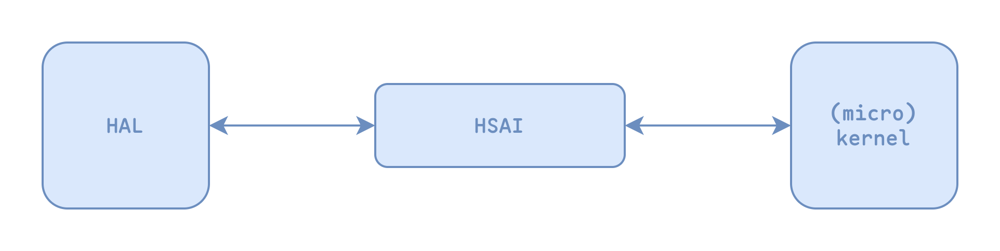
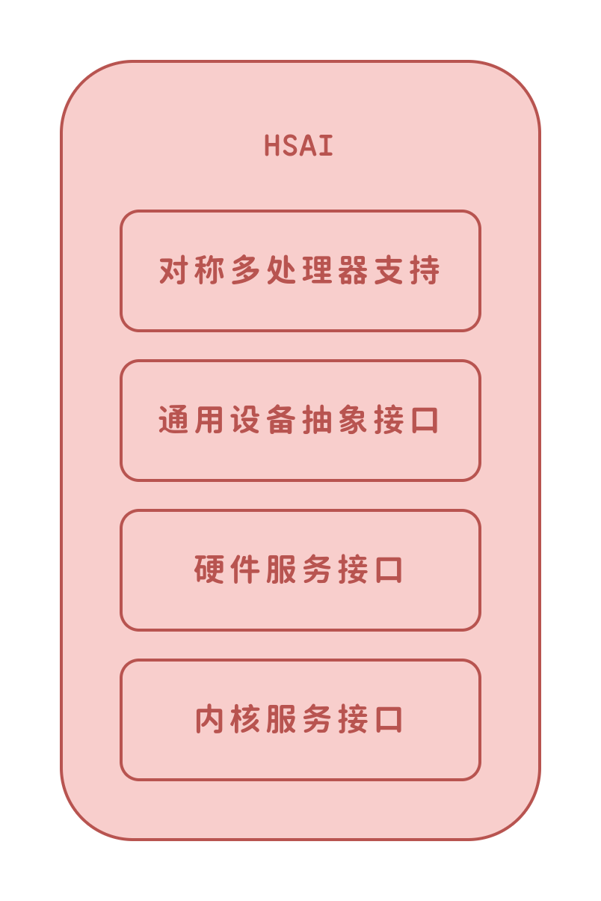

###### OS大赛 - 内核设计loongarch赛道 - 俺争取不掉队 

-------------------------------------------------------------

[`<= 回到目录`](../README.md)

# 硬件接口设计

硬件接口设计使用`俺争取不掉队`提出的硬件服务抽象接口（Hardware Service Abstract Interface, HSAI）。本文档将对 HSAI 设计想法详细阐述。

此处需要特别声明：当前的系统架构设计是沿用了原 V1.x 架构设计的代码修改而来，原来的架构是基于 LoongArch 的 2k1000 qemu 进行设计的，并且原来的架构思想来自于 XV6 的设计思路，因而 HSAI 的抽象接口并不一定具有广泛的兼容性，进行开发时请注意鉴别各模块功能和实现。

## I. 概述

HSAI 的设计初衷是在 kernel 与 HAL 之间架起一座桥梁，让 kernel 与 HAL 两个模块之间的解耦更加清晰。并且 HSAI 作为独立的一个模块，沟通 kernel 与 HAL，使得 HAL 与 kernel 之间不再是上下层的关系，即 HAL 亦可以通过 HSAI 调用 kernel 的服务。

这种设计的好处是，kernel 和 HAL 的设计者都可以屏蔽对方的具体实现，对内核设计去中心化，使整个系统的结构更加灵活可靠。HAL 的设计者亦可以调用部分内核服务来对模块进行调试。

此外，HSAI 中还定义了一些通用的硬件设备抽象类，或是一些已经实现的硬件驱动，HAL 的开发者可以直接继承或者包含进模块直接使用，使 HAL 的开发者将更多精力关注到硬件架构抽象当中。

HSAI 的内部结构主要包括四个部分：SMP、通用设备抽象（通用硬件驱动）、硬件服务接口、内核服务接口。并且 HSAI 内部实现了部分不依赖于 kernel 和 HAL 的算法，例如 SMP 利用 C++11 标准的原子操作支持，实现了完整的自旋锁，HAL 和 kernel 的开发者可以直接使用，而原子操作则由由开发工具链来实现，无需系统开发者关心。

## II. HAL 开发指导

本节将对如何搭建一个开发板的 HAL 并与 HSAI 对接进行指导。注意，本项目使用的是 make 工具进行项目自动化构建，以下指导也仅限于此。使用其他自动构建工具可结合 Makefile 中的脚本作参考。

### i. HAL 模块结构构建和项目构建约定

如果需要创建新的ISA，在 hal/ 下创建对应的架构名称，注意，这个目录的名字将直接影响链接时 HAL 库文件的名字。例如，loongarch 意味着龙芯架构的 ISA。

对于具体的 SoC 或 开发板建议在架构目录下再次创建目录，例如，龙芯2k1000 qemu的目录为 hal/loongarch/qemu_2k1000。

当架构和SoC的目录好后，在项目根目录下的 Makefile 中对于架构和开发板的配置也应当使用相同的名称，以上述 龙芯2k1000 qemu 为例。

	CONF_ARCH=loongarch
	CONF_PLATFORM=qemu_2k1000

项目编译时会以 hal_\$(CONF_ARCH)_\$(CONF_PLATFORM).a 作为 HAL 库文件的名称，并且默认存在于 build/ 下。

### ii. HAL 开发对接 HSAI 指导

HSAI 定义了两个宏 `__hsai_hal` `__hsai_kernel`，带有 `__hsai_hal` 宏标签的类或函数是需要 HAL 实现的。

HSAI 将 CPU 和 Memory 进行了抽象，分别定义了纯虚类 `VirtualCpu` `VirtualMemory`，可通过静态函数 regster_*() 将 HAL 实现的 Cpu 和 Memory 注册到 HSAI 中

在当前的系统架构设计中，使用 UART 作为调试输出，因而在开发过程中，应当保证有一个实现的 UART 驱动，并且使用 `uart/virtual_uart.hh:register_debug_uart()` 函数将其注册到 HSAI 当中，保证正常的调试输出。

## III. HSAI 架构可能发现的问题

- 当前 HSAI 架构仍然不完善，可能有未知的问题
- HSAI 实际上应当包含设备管理，但是目前 XN6 架构变更不完善，设备管理尚未迁移至 HSAI 当中。
