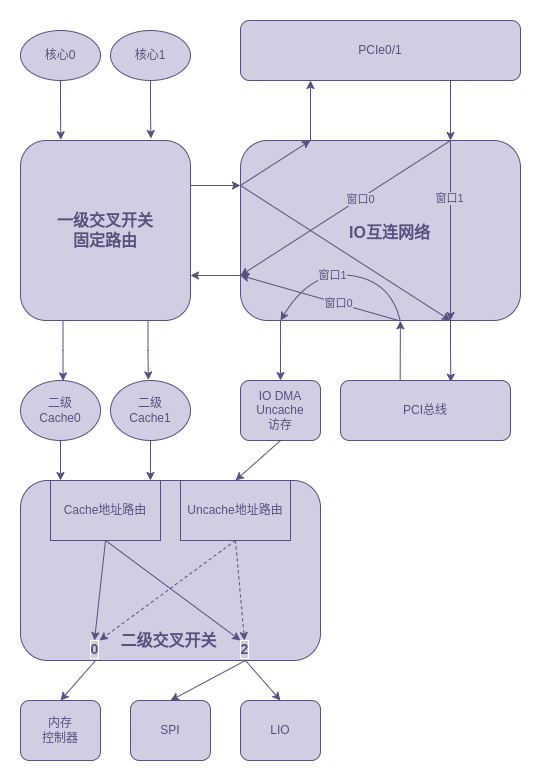

###### OS大赛 - 内核设计loongarch赛道 - 俺争取不掉队

-------------------------------------------------------------

[`<= 回到目录`](../README.md)

# ls2k1000la的IO工作方式

根据ls2k1000的芯片手册绘制出IO网络图如下所示。

### I. SATA 通过 DMA 访存

SATA控制器挂载在PCI总线上，从IO网络图中可以看出，SATA的DMA访存需要经过IO互连网络的窗口1，经过IO DMA Uncache访存，到达二级交叉开关经过uncache地址路由到达标号0的路由地址交由内存控制器来访问。
这其中需要配置好两个窗口，一个是IO互连网络的窗口1，另一个是二级交叉开关的窗口，IO DMA的访存地址需要经过两个窗口映射为实际的物理地址。

IO DMA的二级交叉开关的窗口有8个，其中窗口0默认已经启用：

- pci_win0_base = 0x0000_0000
- pci_win0_mask = 0xffff_ffff_f000_0000 
- pci_win0_mmap = 0x0000_00f0 

从mask和base中看出访存范围是 0x0000_0000 - 0x0fff_ffff

IO互连网络的窗口配置可以考虑：

- xbar_win4_base0 = 0x7000_0000_0000_0000
- xbar_win4_mask0 = 0xffff_ffff_f000_0000
- xbar_win4_mmap0 = 0x0000_0000_0000_0081