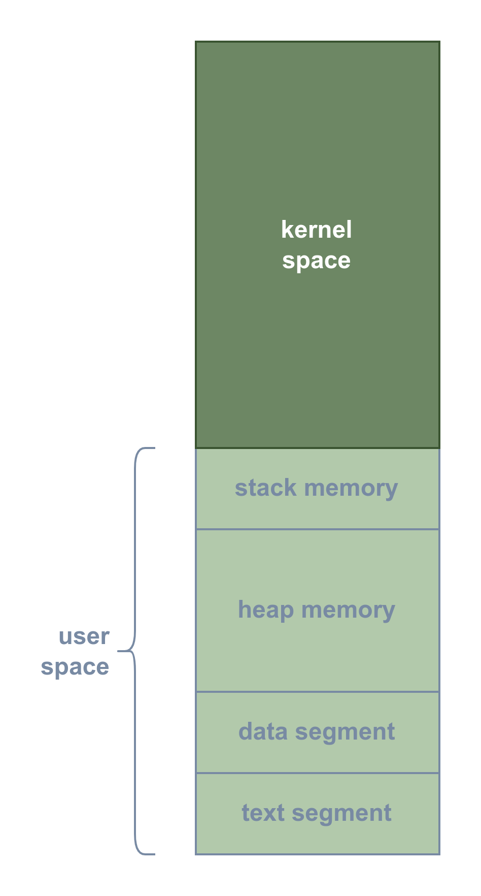
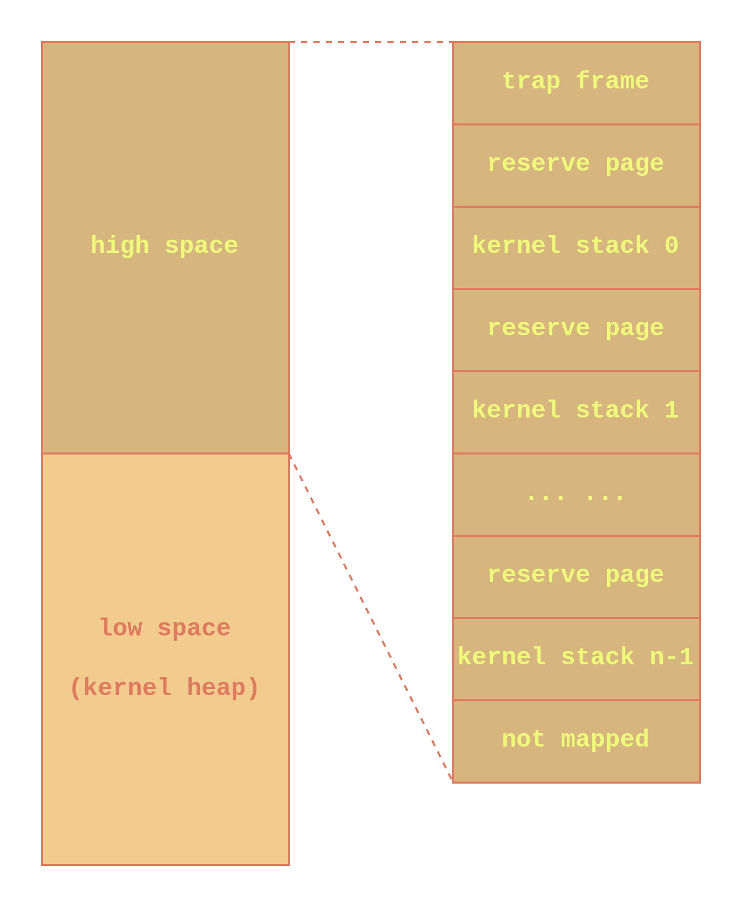
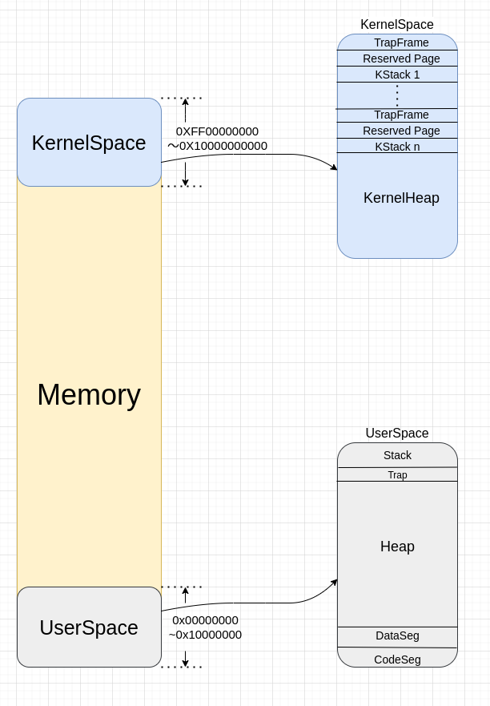

###### OS大赛 - 内核设计loongarch赛道 - 俺争取不掉队

-------------------------------------------------------------

[`<= 回到目录`](../README.md)

# 空间地址划分

## 1 用户地址空间

我们在设计上，让一个CPU核作为一个内核线程看待，而用户进程则可以有多个，形成一对多的线程模型（当前尚未支持SMP，因而将来支持SMP后有可能变更为多对多的线程模型）。每一个进程都有自己独立的虚拟空间，一张全局页目录表就映射了一个进程的虚拟空间，其空间划分可见下图所示。

{:height="70%" width="70%"}

需要说明的是，高地址空间虽然是内核空间，但是由于内核线程比用户进程少，因而在不同的用户进程的虚拟空间中，内核空间往往是同一块。以简单的例子而言，就是当只有一个CPU核时，所有用户虚拟空间的高位其实是被同一个内核线程使用的，只不过因为用户进程的页表并没有映射高地址空间因而无法访问，但是内核线程只有一个即内核的全局页目录表只有一个，它映射了所有用户进程的高地址空间，这部分空间是供内核使用的。换句话说，**用户空间可以说根本没有高地址空间，这部分空间对用户进程不可见**。

## 2 内核地址空间 

内核地址空间是内核线程独立的，即SMP的CPU核数决定内核线程数，也决定了内核全局页目录表数。当然，在LoongArch中，还有映射窗口的概念，通常映射窗口应当是系统特权级，其访存方式与直接访问物理内存没有太大区别，此处不作讨论。

内核地址空间分布如下图所示。

{:height=70% width=70%}

内核低地址空间设计用于堆内存，具体可见[**`动态内存`**](./dyn_mem.md)。

内核高地址空间是内核栈与陷入帧。

### 2.1 陷入帧

陷入帧 ( trap frame ) 是在用户态陷入内核态时，用于保存现场的一个页面，以在从内核态返回时，可以恢复用户进程的运行环境。

### 2.2 内核栈

此处的内核栈并非是内核线程的独立栈，而是在一对多（或多对多）线程模型下使用的内核栈，每一个用户进程都有相对应独立内核栈，使得每个用户进程都认为自己独享内核服务。

在设计上，每个内核栈之间都有一页保留页，用于内核栈间的保护页，这些页面是没有映射到物理内存的，使得栈溢出时会访问非法内存而引起异常。

## 新版地址空间
 
 
新版地址空间的改动： 将用户空间放在内存的 0 ～ 4G， 而内核空间放置在内存的 1T-4G ～ 1T

