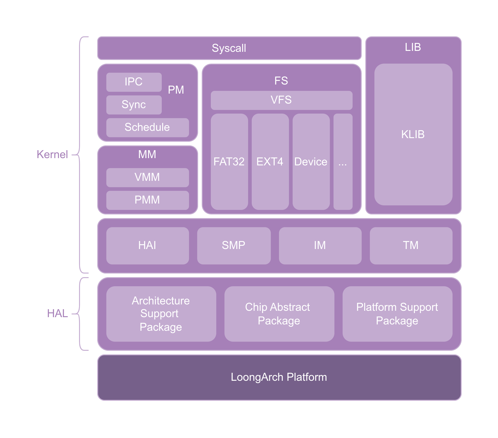

###### OS大赛 - 内核设计loongarch赛道 - 俺争取不掉队 

-------------------------------------------------------------

[`<= 回到目录`](../README.md)

# Makefile工程

当前的工程项目只有kernel一个大模块，用户代码不应写在kernel中。
kernel中也会分为多个模块，这些模块共同组成系统架构，架构图如下所示。

架构图 - v1.1

  

架构图 - v1.2

`当前 XN6 开发进度产生重大变革` 

v1.x 版本的架构图是前期的架构设计，只考虑了在 QEMU-LS2K1000 平台上的运行。为了使平台迁移更加容易，充分利用 C++ 的面向对象特性，对架构做出了重大更改，可见下图 架构图-v2.0 所示。

v2.0 架构以微内核、模块化为指导设计思想，力求各模块间松耦合，为适应嵌入式开发架构多样的特点，围绕硬件服务接口为中心，解耦硬件抽象层与内核模块。同时分离文件系统支持，进一步缩小内核规模，并参考 Linux VFS 思想，抽象文件系统接口，实现对多种文件系统的支持。

硬件服务抽象接口模块定义清晰地好了内核需要使用的服务接口，在进行平台移植时，可以只需要考虑接口实现，而无需关注内核实现。C++面向对象带来的高可读性，可以使实现硬件抽象层时更为简易。同时，硬件服务抽象接口还定义了通用设备接口，可以为硬件抽象层在实现具体的设备驱动时减少工作量。硬件服务抽象接口还包含了 SMP，这一支持包采用 C++ 的一些特性实现，目前已经包含了自旋锁的实现（实际上大量工作是由编译器保证的）。

XN6 OS 使用 GCC 作为标准编译器，暂不支持其他编译器。编译使用 C++23 标准，因而 GCC 版本需求 13.1+。

架构图 - v2.0

## I. 如何插入新模块到kernel

1. 新建模块到kernel/下，例如，smp. 
2. 在kernel/include/下新建smp. 
~~3. 在kernel/Makefile中为submod变量添加smp.~~
`已经修改Makefile为递归识别所有目录和文件，不需要修改Makefile`
`步骤1、2只是为了遵循开发规范，理论上kernel文件夹内的任何目录和c\c++以及汇编文件（c、cc、S后缀名）均会被识别`
