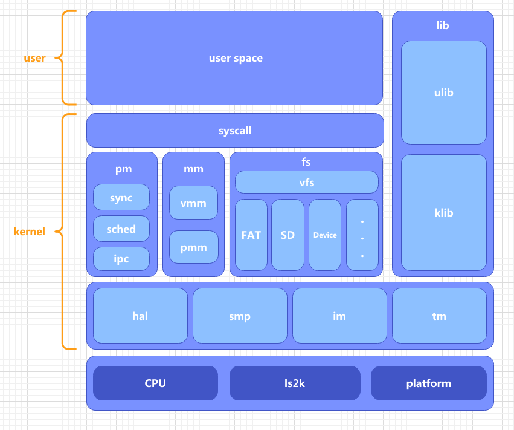
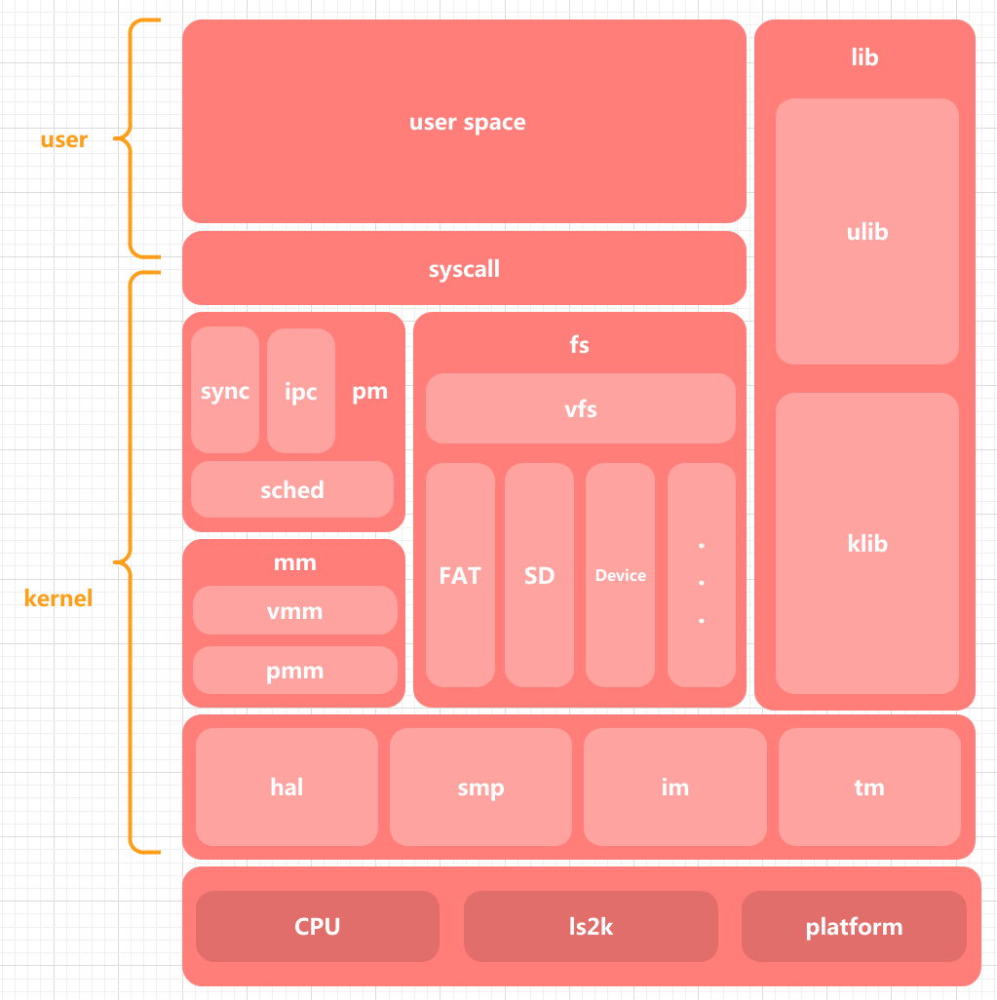

###### OS大赛 - 内核设计loongarch赛道 - 俺争取不掉队 

-------------------------------------------------------------

[`<= 回到目录`](../README.md)

# Makefile工程

当前的工程项目只有kernel一个大模块，用户代码不应写在kernel中。
kernel中也会分为多个模块，这些模块共同组成系统架构，架构图如下所示。

架构图 - v1.1

  

架构图 - v1.2

## I. 如何插入新模块到kernel

1. 新建模块到kernel/下，例如，smp. 
2. 在kernel/include/下新建smp. 
~~3. 在kernel/Makefile中为submod变量添加smp.~~
`已经修改Makefile为递归识别所有目录和文件，不需要修改Makefile`
`步骤1、2只是为了遵循开发规范，理论上kernel文件夹内的任何目录和c\c++以及汇编文件（c、cc、S后缀名）均会被识别`
