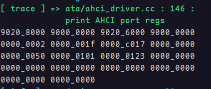

# 2k1000LA星云板上的SATA的DMA访存异常

## 问题描述

在试验的过程中，我发现当我给 AHCI 的端口寄存器 CLB 和 FB 分别分配Command List和FIS的地址时，DMA访存似乎出现了异常，如图是我分配地址之后，端口寄存器的值

其中开头的四个数值分别是AHCI文档所述的 CLB、CLBU、FB、FBU 寄存器的值，即我为这个端口分配的 CLB 和 FB 的地址分别是 `0x9000'0000'9020'8000` 和 `0x9000'0000'9020'6000`。

这两个地址在AHCI文档所述中是及其重要的地址，因为SATA的两个DMA根据这两个地址分别来获取要发送的命令和接受到FIS需要存储的位置。当我使用上述的CLB地址的时候，我发现我发送 `READ DMA EXT` 命令（代码25h）是无效的，经过试验我猜测是SATA的DMA无法读出这个地址内的数据（这个地址里面就配置了我要发送的命令）。然后DMA一直试图访存读出有效的命令，但是一直失败，于是端口一直处于忙状态（端口寄存器`TFD.STS.BSY`为1表示忙状态）并且无法发出命令，自然也无法正确地读出数据。

而当我将CLB和FB的地址改成使用uboot的地址之后访存就正常了。换句话说，我通过对比uboot的地址和我的内核提供的地址来访存是否正常，推测出了上述的访存失败。下面是我使用uboot提供的地址的具体操作。

我使用 uboot 初始化SATA控制器时使用的地址。即，我先在 uboot 中使用 `scsi reset` 命令来重置 SATA 控制器，并且经过试验我发现 uboot 已经配置好了 CLB 和 FB，如图所示是端口寄存器的值。

可以看到 CLB 的地址是 `0x9000'0000'0BC5'F800`，而 FB 的地址是 `0x9000'0000'0BC5'F900`。这个地址和我配置的地址看上去最大的不同是低32位的高4位不是`0x9`而是`0`，这个地址是属于uboot所在的`0x0000'0000~0x1000'0000` 空间（即便高4位是0x9有点奇怪，但是它确实能正常访存）。而当我使用这个地址的时候，发送命令就正常了，不仅成功发送了命令，而且命令执行完成后也正常发生了中断，一切都是正常的。

我推测这是来自 2k1000LA 对 IO互连网络的地址路由的配置问题。于是我将`二级交叉开关地址窗口` 和 `IO互连网络地址窗口` 打印了出来。

理论上来说，SATA控制器的DMA应当经过IO互连网络地址窗口到达二级交叉开关，然后再经过二级交叉开关的地址窗口映射到内存当中，但是按照上面输出的信息，IO互连网络并没有被配置。那么**SATA控制器的DMA是如何访存的呢**？

假定SATA DMA不经过IO互连网络，那么到达二级交叉开关的时候会经过上图中IO DMA的win0窗口映射，看起来它的确屏蔽了我的以`0x9020'8000`为地址的CLB（但是这里依旧有疑问：使用uboot提供的**高32位中的高4位明明是0x9，但是为什么没有被窗口过滤呢？**）。

假设是窗口映射有问题，我将IO DMA的win0的mask配置为 `0xFFFF'FFFF'0000'0000`，使得 `0x9***'****` 这样的地址可以通过win0的窗口，但是我发现没有用。

这个时候我已经搞不明白二级交叉开关和IO互连网络的路由遵循什么机制了，因为上述的实验说明星云板上的2k1000LA似乎没有遵循手册上的逻辑？

这里面有两个问题亟待解决：

1) **我应当如何配置窗口地址映射，使得我提供的`0x9***'****`这样的地址也能被正常访问？**
2) **为什么64位地址的高4位是`0x9`也没有影响访存，二级交叉开关和IO互连网络的窗口映射逻辑应当如何正确理解？**
